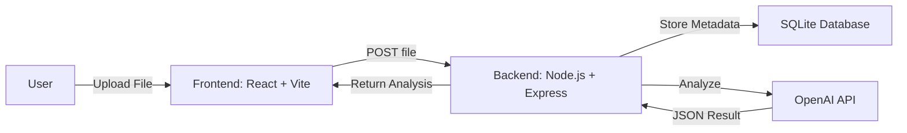

# Document Analyzer (React + Vite)

The **document_analyzer_reactjs** project is a Vite-based web application that allows users to upload documents and automatically generate AI-powered analysis. The application provides:

- Uploading of local documents  
- Automated OpenAI analysis, including:  
  - **Summary** (2–3 sentences)  
  - **Key Topics** (3–5 bullet points)  
  - **Document Type**

---

## Setup Instructions

Follow the steps below to install, configure, and run the application locally.

### Prerequisites
- Node.js v18+
- npm (bundled with Node.js)
- OpenAI API key (for AI analysis)
- Git

---

## Clone the Repository

```
git clone git@github.com:BlueMeridian4/document_analyzer_reactjs.git
```

#### Alternative: Download ZIP version
Run the following commands in terminal:

*_Download zip file from repository_
```
unzip document_analyzer_reactjs-main.zip
cd document_analyzer_reactjs-main
git init
git add .
git remote add origin https://github.com/BlueMeridian4/document_analyzer_reactjs.git
git remote update
git checkout master
```

#### Install dependencies for Frontend
```
cd document_analyzer_reactjs
npm install
```

#### Install dependencies for Backend
```
cd document_analyzer_reactjs/server

npm install
touch .env
```

Add the following to your document_analyzer_reactjs/server/.env file
```
OPENAI_API_KEY=your_api_key_here
```

Then start the server by running the following command
```
node index.js
```

#### Run application locally
Return to the main project folder document_analyzer_reactjs and start the frontend vite application
```
cd ..
npm run dev
```

Open your browser to the frontend URL, it should be the same or similar to the following URL:
```
http://localhost:5173
```

## Architecture Overview
- Frontend: React + Vite for the UI
- Backend: Node.js + Express server
- Database: SQLite (via better-sqlite3)
- AI Service: OpenAI API for document analysis

Data Flow
- User uploads a file through the React frontend.
- File is sent to Express backend via HTTP POST.
- Backend stores metadata in SQLite.
- Backend calls OpenAI API to analyze the document.
- Results are stored in SQLite and returned to the frontend.
- Frontend displays structured analysis to the user.



## Assumptions Made
1. Backend / API Assumptions
The OpenAI API key is valid and has sufficient quota to handle requests.
API responses are consistently structured as JSON with summary, key_topics, document_type, and tokens.
AI analysis responses are small enough to process quickly (documents are limited to a few pages for testing).
The backend is always reachable by the frontend (localhost during development).

2. Frontend / UI Assumptions
Users upload only supported file types (PDF or text).
Files are not extremely large (no gigabyte-sized documents).
Users interact with the UI in a modern browser that supports JavaScript and CSS features (React + Tailwind).
Users have a stable internet connection (for sending files to the backend and receiving AI responses).

3. Database / Storage Assumptions
SQLite (better-sqlite3) is sufficient for storing metadata and analysis results (small-scale data, no high concurrency).
Only one backend instance is running; no need for distributed database setup.

4. Security / Privacy Assumptions
The system is for local or small-scale use; no authentication or strict access control implemented.
Uploaded documents are trusted and safe (no malware scanning).

5. Development / Deployment Assumptions
Development is done locally on Node.js >= v18 and modern browsers.
Users can run Vite for the frontend without creating a new Vite project from scratch.
The repository includes all necessary packages in package.json and package-lock.json.

### React + Vite

This template provides a minimal setup to get React working in Vite with HMR and some ESLint rules.

Currently, two official plugins are available:

- [@vitejs/plugin-react](https://github.com/vitejs/vite-plugin-react/blob/main/packages/plugin-react) uses [Babel](https://babeljs.io/) (or [oxc](https://oxc.rs) when used in [rolldown-vite](https://vite.dev/guide/rolldown)) for Fast Refresh
- [@vitejs/plugin-react-swc](https://github.com/vitejs/vite-plugin-react/blob/main/packages/plugin-react-swc) uses [SWC](https://swc.rs/) for Fast Refresh

### React Compiler

The React Compiler is enabled on this template. See [this documentation](https://react.dev/learn/react-compiler) for more information.

Note: This will impact Vite dev & build performances.

### Expanding the ESLint configuration

If you are developing a production application, we recommend using TypeScript with type-aware lint rules enabled. Check out the [TS template](https://github.com/vitejs/vite/tree/main/packages/create-vite/template-react-ts) for information on how to integrate TypeScript and [`typescript-eslint`](https://typescript-eslint.io) in your project.
